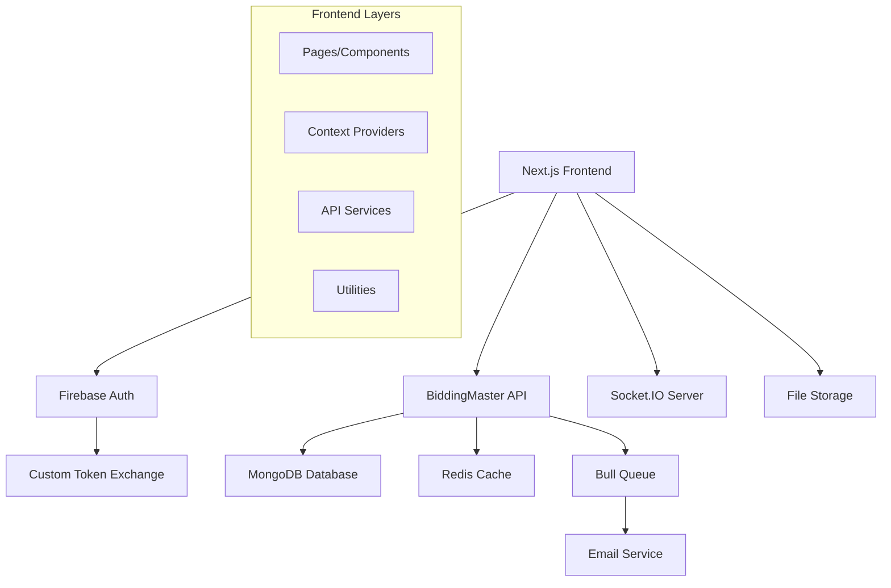
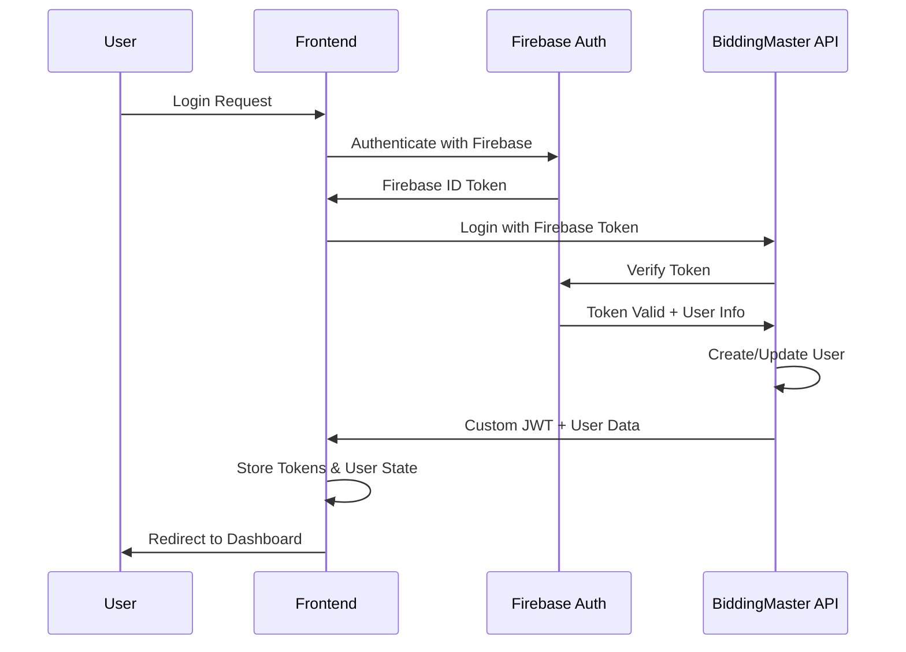

# BiddingMaster Frontend Design Document

## Overview

BiddingMaster is a reverse bidding platform where buyers create requirements and sellers compete by placing progressively lower bids. The frontend is a Next.js 14+ application with Firebase Authentication, providing a modern, responsive interface for both buyers and sellers to participate in the bidding ecosystem.

### Key Features
- **Dual Role System**: Users can act as both buyers and sellers
- **Real-time Bidding**: Live updates using Socket.IO for active bidding sessions
- **Firebase Authentication**: Secure authentication with multiple providers
- **Responsive Design**: Mobile-first approach with modern UI/UX
- **File Management**: Support for requirement and bid attachments
- **Email Notifications**: Automated notifications for bidding lifecycle events

### Technology Stack
- **Framework**: Next.js 14+ with App Router
- **Authentication**: Firebase Auth with custom token integration
- **State Management**: React Context API with custom hooks
- **Styling**: Tailwind CSS with shadcn/ui components
- **HTTP Client**: Axios with interceptors for API communication
- **Real-time**: Socket.IO client for live updates
- **File Upload**: Multipart form handling with progress indicators
- **TypeScript**: Full type safety throughout the application

## Architecture

### High-Level Architecture



### Application Structure

The application follows a layered architecture pattern:

1. **Presentation Layer**: React components and pages
2. **State Management Layer**: Context providers and custom hooks
3. **Service Layer**: API communication and business logic
4. **Utility Layer**: Helper functions and configurations
## Components and Interfaces

### Folder Structure

```
src/
├── app/                          # Next.js 14 App Router
│   ├── (auth)/                   # Auth route group
│   │   ├── login/
│   │   └── register/
│   ├── (dashboard)/              # Protected route group
│   │   ├── dashboard/
│   │   ├── requirements/
│   │   ├── bids/
│   │   └── profile/
│   ├── globals.css
│   ├── layout.tsx
│   └── page.tsx
├── components/                   # Reusable UI components
│   ├── ui/                       # shadcn/ui components
│   ├── forms/                    # Form components
│   ├── layout/                   # Layout components
│   ├── bidding/                  # Bidding-specific components
│   └── common/                   # Common components
├── contexts/                     # React Context providers
│   ├── AuthContext.tsx
│   ├── SocketContext.tsx
│   └── NotificationContext.tsx
├── hooks/                        # Custom React hooks
│   ├── useAuth.ts
│   ├── useSocket.ts
│   ├── useApi.ts
│   └── useLocalStorage.ts
├── lib/                          # Utility libraries
│   ├── api.ts                    # Axios configuration
│   ├── firebase.ts               # Firebase configuration
│   ├── socket.ts                 # Socket.IO configuration
│   ├── utils.ts                  # General utilities
│   └── validations.ts            # Form validation schemas
├── services/                     # API service layer
│   ├── auth.service.ts
│   ├── requirement.service.ts
│   ├── bid.service.ts
│   └── user.service.ts
├── types/                        # TypeScript type definitions
│   ├── auth.types.ts
│   ├── requirement.types.ts
│   ├── bid.types.ts
│   └── api.types.ts
└── middleware.ts                 # Next.js middleware for auth
```

### Core Components

#### Authentication Components

**LoginForm Component**
```typescript
interface LoginFormProps {
  onSuccess?: () => void;
  redirectTo?: string;
}

const LoginForm: React.FC<LoginFormProps> = ({ onSuccess, redirectTo }) => {
  // Firebase auth integration
  // Form validation
  // Error handling
  // Loading states
};
```

**RegisterForm Component**
```typescript
interface RegisterFormProps {
  onSuccess?: () => void;
  userRole?: 'buyer' | 'seller' | 'both';
}

const RegisterForm: React.FC<RegisterFormProps> = ({ onSuccess, userRole }) => {
  // Multi-step registration
  // Firebase auth + custom backend registration
  // Form validation with business rules
  // File upload for profile picture
};
```

#### Requirement Management Components

**RequirementCard Component**
```typescript
interface RequirementCardProps {
  requirement: Requirement;
  viewMode: 'buyer' | 'seller' | 'public';
  onBidClick?: (requirementId: string) => void;
  onEditClick?: (requirementId: string) => void;
}

const RequirementCard: React.FC<RequirementCardProps> = ({
  requirement,
  viewMode,
  onBidClick,
  onEditClick
}) => {
  // Status-based styling
  // Time countdown for active requirements
  // Bid statistics display
  // Action buttons based on user role
};
```

**RequirementForm Component**
```typescript
interface RequirementFormProps {
  mode: 'create' | 'edit';
  initialData?: Partial<Requirement>;
  onSubmit: (data: RequirementFormData) => Promise<void>;
}

const RequirementForm: React.FC<RequirementFormProps> = ({
  mode,
  initialData,
  onSubmit
}) => {
  // Multi-step form for complex requirements
  // File upload with drag-and-drop
  // Participant invitation management
  // Date/time validation
  // Draft save functionality
};
```

#### Bidding Components

**BidForm Component**
```typescript
interface BidFormProps {
  requirement: Requirement;
  currentBestBid?: Bid;
  onSubmit: (bidData: BidFormData) => Promise<void>;
}

const BidForm: React.FC<BidFormProps> = ({
  requirement,
  currentBestBid,
  onSubmit
}) => {
  // Price validation against ceiling and minimum decrement
  // Real-time price suggestions
  // Attachment upload
  // Delivery days estimation
  // Terms acceptance
};
```

**BidList Component**
```typescript
interface BidListProps {
  requirementId: string;
  viewMode: 'buyer' | 'seller';
  realTimeUpdates?: boolean;
}

const BidList: React.FC<BidListProps> = ({
  requirementId,
  viewMode,
  realTimeUpdates
}) => {
  // Real-time bid updates via Socket.IO
  // Conditional visibility based on user role
  // Bid ranking and highlighting
  // Winner selection (buyer view)
};
```

#### Layout Components

**DashboardLayout Component**
```typescript
interface DashboardLayoutProps {
  children: React.ReactNode;
  title?: string;
  actions?: React.ReactNode;
}

const DashboardLayout: React.FC<DashboardLayoutProps> = ({
  children,
  title,
  actions
}) => {
  // Responsive sidebar navigation
  // User profile dropdown
  // Notification center
  // Role-based menu items
};
```

**ProtectedRoute Component**
```typescript
interface ProtectedRouteProps {
  children: React.ReactNode;
  requiredRoles?: UserRole[];
  fallback?: React.ReactNode;
}

const ProtectedRoute: React.FC<ProtectedRouteProps> = ({
  children,
  requiredRoles,
  fallback
}) => {
  // Authentication check
  // Role-based access control
  // Loading states
  // Redirect handling
};
```
## Data Models

### TypeScript Interfaces

#### User Types
```typescript
export interface User {
  _id: string;
  firstName: string;
  lastName: string;
  email: string;
  phone: string;
  address: string;
  pincode: string;
  gstNo: string;
  designation: string;
  industry: string;
  profilePic?: {
    key: string;
    url: string;
  };
  dob: string;
  firebaseUid: string;
  firebaseSignInProvider: string;
  roles: UserRole[];
  appNotificationsLastSeenAt: string;
  isBlocked: boolean;
  isDeleted: boolean;
  isEmailVerified: boolean;
  preferences: {
    notificationEnabled: boolean;
    locationShared: boolean;
  };
  createdAt: string;
  updatedAt: string;
}

export type UserRole = 'Buyer' | 'Seller' | 'Admin';

export interface UserRegistrationData {
  firstName: string;
  lastName: string;
  email: string;
  phone: string;
  address: string;
  pincode: string;
  gstNo: string;
  designation: string;
  industry: string;
  dob: string;
  profilePic?: File;
  roles: UserRole[];
}
```

#### Requirement Types
```typescript
export interface Requirement {
  _id: string;
  title: string;
  description: string;
  category?: string;
  attachments: Attachment[];
  currency: string;
  ceilingPrice: number;
  minDecrement: number;
  startTime: string;
  endTime: string;
  participants: Participant[];
  status: RequirementStatus;
  createdBy: string | User;
  winningBid?: string | Bid;
  createdAt: string;
  updatedAt: string;
}

export type RequirementStatus = 'DRAFT' | 'ACTIVE' | 'CLOSED' | 'AWARDED';

export interface Participant {
  email: string;
  userId?: string;
  status: 'INVITED' | 'JOINED';
}

export interface Attachment {
  key: string;
  url: string;
}

export interface RequirementFormData {
  title: string;
  description: string;
  category?: string;
  attachments?: File[];
  currency: string;
  ceilingPrice: number;
  minDecrement: number;
  startTime: string;
  endTime: string;
  participants?: string[]; // email addresses
  status: RequirementStatus;
}
```

#### Bid Types
```typescript
export interface Bid {
  _id: string;
  requirement: string | Requirement;
  bidder: string | User;
  offeredPrice: number;
  deliveryDays?: number;
  notes: string;
  attachments: Attachment[];
  createdAt: string;
  updatedAt: string;
}

export interface BidFormData {
  offeredPrice: number;
  deliveryDays?: number;
  notes?: string;
  attachments?: File[];
}

export interface BidStatistics {
  totalBids: number;
  lowestBid?: number;
  averageBid?: number;
  myBid?: Bid;
  timeRemaining?: number;
}
```

#### API Response Types
```typescript
export interface ApiResponse<T = any> {
  success: boolean;
  data?: T;
  message?: string;
  error?: string;
}

export interface PaginatedResponse<T> {
  results: T[];
  page: number;
  limit: number;
  totalPages: number;
  totalResults: number;
}

export interface AuthResponse {
  user: User;
  tokens: {
    access: {
      token: string;
      expires: string;
    };
    refresh: {
      token: string;
      expires: string;
    };
  };
}
```

#### Socket Event Types
```typescript
export interface SocketEvents {
  // Client to Server
  'join-requirement': { requirementId: string };
  'leave-requirement': { requirementId: string };
  'new-bid': { requirementId: string; bid: Bid };
  
  // Server to Client
  'bid-update': { requirementId: string; bid: Bid; statistics: BidStatistics };
  'requirement-status-change': { requirementId: string; status: RequirementStatus };
  'bidding-ended': { requirementId: string; winningBid?: Bid };
  'user-joined': { requirementId: string; userId: string };
}
```

### Form Validation Schemas

```typescript
import { z } from 'zod';

export const requirementSchema = z.object({
  title: z.string().min(5, 'Title must be at least 5 characters'),
  description: z.string().min(20, 'Description must be at least 20 characters'),
  category: z.string().optional(),
  currency: z.string().default('INR'),
  ceilingPrice: z.number().min(1, 'Ceiling price must be greater than 0'),
  minDecrement: z.number().min(1, 'Minimum decrement must be greater than 0'),
  startTime: z.string().refine((date) => new Date(date) > new Date(), {
    message: 'Start time must be in the future'
  }),
  endTime: z.string(),
  participants: z.array(z.string().email()).optional(),
}).refine((data) => new Date(data.endTime) > new Date(data.startTime), {
  message: 'End time must be after start time',
  path: ['endTime']
});

export const bidSchema = z.object({
  offeredPrice: z.number().min(1, 'Offered price must be greater than 0'),
  deliveryDays: z.number().min(1).optional(),
  notes: z.string().max(500, 'Notes cannot exceed 500 characters').optional(),
});

export const userRegistrationSchema = z.object({
  firstName: z.string().min(2, 'First name must be at least 2 characters'),
  lastName: z.string().min(2, 'Last name must be at least 2 characters'),
  email: z.string().email('Invalid email address'),
  phone: z.string().regex(/^[6-9]\d{9}$/, 'Invalid Indian phone number'),
  address: z.string().min(10, 'Address must be at least 10 characters'),
  pincode: z.string().regex(/^\d{6}$/, 'Invalid pincode'),
  gstNo: z.string().regex(/^[0-9]{2}[A-Z]{5}[0-9]{4}[A-Z]{1}[1-9A-Z]{1}Z[0-9A-Z]{1}$/, 'Invalid GST number'),
  designation: z.string().min(2, 'Designation is required'),
  industry: z.string().min(2, 'Industry is required'),
  dob: z.string().refine((date) => {
    const age = new Date().getFullYear() - new Date(date).getFullYear();
    return age >= 18 && age <= 100;
  }, 'Age must be between 18 and 100'),
  roles: z.array(z.enum(['Buyer', 'Seller'])).min(1, 'At least one role is required'),
});
```
## Firebase Authentication Integration

### Authentication Flow



### Firebase Configuration

```typescript
// lib/firebase.ts
import { initializeApp } from 'firebase/app';
import { getAuth, connectAuthEmulator } from 'firebase/auth';

const firebaseConfig = {
  apiKey: process.env.NEXT_PUBLIC_FIREBASE_API_KEY,
  authDomain: process.env.NEXT_PUBLIC_FIREBASE_AUTH_DOMAIN,
  projectId: process.env.NEXT_PUBLIC_FIREBASE_PROJECT_ID,
  storageBucket: process.env.NEXT_PUBLIC_FIREBASE_STORAGE_BUCKET,
  messagingSenderId: process.env.NEXT_PUBLIC_FIREBASE_MESSAGING_SENDER_ID,
  appId: process.env.NEXT_PUBLIC_FIREBASE_APP_ID,
};

const app = initializeApp(firebaseConfig);
export const auth = getAuth(app);

// Connect to emulator in development
if (process.env.NODE_ENV === 'development' && !auth.emulatorConfig) {
  connectAuthEmulator(auth, 'http://localhost:9099');
}

export default app;
```

### Authentication Context

```typescript
// contexts/AuthContext.tsx
import React, { createContext, useContext, useEffect, useState } from 'react';
import { User as FirebaseUser, onAuthStateChanged, signOut } from 'firebase/auth';
import { auth } from '@/lib/firebase';
import { User } from '@/types/auth.types';
import { authService } from '@/services/auth.service';

interface AuthContextType {
  user: User | null;
  firebaseUser: FirebaseUser | null;
  loading: boolean;
  login: (email: string, password: string) => Promise<void>;
  register: (userData: UserRegistrationData) => Promise<void>;
  logout: () => Promise<void>;
  refreshUser: () => Promise<void>;
}

const AuthContext = createContext<AuthContextType | undefined>(undefined);

export const AuthProvider: React.FC<{ children: React.ReactNode }> = ({ children }) => {
  const [user, setUser] = useState<User | null>(null);
  const [firebaseUser, setFirebaseUser] = useState<FirebaseUser | null>(null);
  const [loading, setLoading] = useState(true);

  useEffect(() => {
    const unsubscribe = onAuthStateChanged(auth, async (firebaseUser) => {
      setFirebaseUser(firebaseUser);
      
      if (firebaseUser) {
        try {
          // Get custom token from backend
          const idToken = await firebaseUser.getIdToken();
          const response = await authService.login(idToken);
          setUser(response.user);
          
          // Store tokens in localStorage
          localStorage.setItem('accessToken', response.tokens.access.token);
          localStorage.setItem('refreshToken', response.tokens.refresh.token);
        } catch (error) {
          console.error('Auth error:', error);
          setUser(null);
        }
      } else {
        setUser(null);
        localStorage.removeItem('accessToken');
        localStorage.removeItem('refreshToken');
      }
      
      setLoading(false);
    });

    return unsubscribe;
  }, []);

  const login = async (email: string, password: string) => {
    setLoading(true);
    try {
      await signInWithEmailAndPassword(auth, email, password);
      // User state will be updated by onAuthStateChanged
    } catch (error) {
      setLoading(false);
      throw error;
    }
  };

  const register = async (userData: UserRegistrationData) => {
    setLoading(true);
    try {
      // Create Firebase user first
      const credential = await createUserWithEmailAndPassword(auth, userData.email, userData.password);
      
      // Register with backend
      const idToken = await credential.user.getIdToken();
      await authService.register(userData, idToken);
      
      // User state will be updated by onAuthStateChanged
    } catch (error) {
      setLoading(false);
      throw error;
    }
  };

  const logout = async () => {
    await signOut(auth);
    setUser(null);
    setFirebaseUser(null);
    localStorage.removeItem('accessToken');
    localStorage.removeItem('refreshToken');
  };

  const refreshUser = async () => {
    if (firebaseUser) {
      const idToken = await firebaseUser.getIdToken(true);
      const response = await authService.login(idToken);
      setUser(response.user);
    }
  };

  const value = {
    user,
    firebaseUser,
    loading,
    login,
    register,
    logout,
    refreshUser,
  };

  return <AuthContext.Provider value={value}>{children}</AuthContext.Provider>;
};

export const useAuth = () => {
  const context = useContext(AuthContext);
  if (context === undefined) {
    throw new Error('useAuth must be used within an AuthProvider');
  }
  return context;
};
```

### Protected Route Middleware

```typescript
// middleware.ts
import { NextRequest, NextResponse } from 'next/server';
import { jwtVerify } from 'jose';

const JWT_SECRET = new TextEncoder().encode(process.env.JWT_SECRET);

export async function middleware(request: NextRequest) {
  const { pathname } = request.nextUrl;

  // Public routes that don't require authentication
  const publicRoutes = ['/', '/login', '/register', '/about'];
  const isPublicRoute = publicRoutes.some(route => pathname.startsWith(route));

  if (isPublicRoute) {
    return NextResponse.next();
  }

  // Check for authentication token
  const token = request.cookies.get('accessToken')?.value || 
                request.headers.get('authorization')?.replace('Bearer ', '');

  if (!token) {
    return NextResponse.redirect(new URL('/login', request.url));
  }

  try {
    // Verify JWT token
    await jwtVerify(token, JWT_SECRET);
    return NextResponse.next();
  } catch (error) {
    // Token is invalid, redirect to login
    return NextResponse.redirect(new URL('/login', request.url));
  }
}

export const config = {
  matcher: [
    '/((?!api|_next/static|_next/image|favicon.ico).*)',
  ],
};
```
## API Service Layer Design

### Axios Configuration with Interceptors

```typescript
// lib/api.ts
import axios, { AxiosInstance, AxiosRequestConfig, AxiosResponse } from 'axios';
import { auth } from './firebase';

class ApiClient {
  private client: AxiosInstance;

  constructor() {
    this.client = axios.create({
      baseURL: process.env.NEXT_PUBLIC_API_BASE_URL || 'http://localhost:3001/v1',
      timeout: 30000,
      headers: {
        'Content-Type': 'application/json',
      },
    });

    this.setupInterceptors();
  }

  private setupInterceptors() {
    // Request interceptor to add auth token
    this.client.interceptors.request.use(
      async (config) => {
        const token = localStorage.getItem('accessToken');
        if (token) {
          config.headers.Authorization = `Bearer ${token}`;
        }
        return config;
      },
      (error) => {
        return Promise.reject(error);
      }
    );

    // Response interceptor for error handling and token refresh
    this.client.interceptors.response.use(
      (response: AxiosResponse) => {
        return response;
      },
      async (error) => {
        const originalRequest = error.config;

        if (error.response?.status === 401 && !originalRequest._retry) {
          originalRequest._retry = true;

          try {
            // Try to refresh the token using Firebase
            const currentUser = auth.currentUser;
            if (currentUser) {
              const newToken = await currentUser.getIdToken(true);
              
              // Update the token in localStorage
              localStorage.setItem('accessToken', newToken);
              
              // Retry the original request with new token
              originalRequest.headers.Authorization = `Bearer ${newToken}`;
              return this.client(originalRequest);
            }
          } catch (refreshError) {
            // Refresh failed, redirect to login
            localStorage.removeItem('accessToken');
            localStorage.removeItem('refreshToken');
            window.location.href = '/login';
            return Promise.reject(refreshError);
          }
        }

        return Promise.reject(error);
      }
    );
  }

  // HTTP methods
  async get<T>(url: string, config?: AxiosRequestConfig): Promise<T> {
    const response = await this.client.get<T>(url, config);
    return response.data;
  }

  async post<T>(url: string, data?: any, config?: AxiosRequestConfig): Promise<T> {
    const response = await this.client.post<T>(url, data, config);
    return response.data;
  }

  async put<T>(url: string, data?: any, config?: AxiosRequestConfig): Promise<T> {
    const response = await this.client.put<T>(url, data, config);
    return response.data;
  }

  async patch<T>(url: string, data?: any, config?: AxiosRequestConfig): Promise<T> {
    const response = await this.client.patch<T>(url, data, config);
    return response.data;
  }

  async delete<T>(url: string, config?: AxiosRequestConfig): Promise<T> {
    const response = await this.client.delete<T>(url, config);
    return response.data;
  }

  // File upload method
  async uploadFile<T>(url: string, formData: FormData, onProgress?: (progress: number) => void): Promise<T> {
    const response = await this.client.post<T>(url, formData, {
      headers: {
        'Content-Type': 'multipart/form-data',
      },
      onUploadProgress: (progressEvent) => {
        if (onProgress && progressEvent.total) {
          const progress = Math.round((progressEvent.loaded * 100) / progressEvent.total);
          onProgress(progress);
        }
      },
    });
    return response.data;
  }
}

export const apiClient = new ApiClient();
```

### Service Layer Implementation

```typescript
// services/auth.service.ts
import { apiClient } from '@/lib/api';
import { AuthResponse, User, UserRegistrationData } from '@/types/auth.types';

class AuthService {
  async login(firebaseToken: string): Promise<AuthResponse> {
    return apiClient.post<AuthResponse>('/auth/login', {
      firebaseToken,
    });
  }

  async register(userData: UserRegistrationData, firebaseToken: string): Promise<AuthResponse> {
    const formData = new FormData();
    
    // Append user data
    Object.entries(userData).forEach(([key, value]) => {
      if (key === 'profilePic' && value instanceof File) {
        formData.append('profilePic', value);
      } else if (key === 'roles' && Array.isArray(value)) {
        formData.append('roles', JSON.stringify(value));
      } else if (value !== undefined) {
        formData.append(key, value.toString());
      }
    });

    return apiClient.uploadFile<AuthResponse>('/auth/register', formData);
  }

  async getProfile(): Promise<User> {
    return apiClient.get<User>('/users/me');
  }

  async updateProfile(userData: Partial<UserRegistrationData>): Promise<User> {
    const formData = new FormData();
    
    Object.entries(userData).forEach(([key, value]) => {
      if (key === 'profilePic' && value instanceof File) {
        formData.append('profilePic', value);
      } else if (value !== undefined) {
        formData.append(key, value.toString());
      }
    });

    return apiClient.uploadFile<User>('/users/updateDetails', formData);
  }
}

export const authService = new AuthService();
```

```typescript
// services/requirement.service.ts
import { apiClient } from '@/lib/api';
import { Requirement, RequirementFormData, PaginatedResponse } from '@/types';

class RequirementService {
  async createRequirement(data: RequirementFormData): Promise<Requirement> {
    const formData = new FormData();
    
    // Append requirement data
    Object.entries(data).forEach(([key, value]) => {
      if (key === 'attachments' && Array.isArray(value)) {
        value.forEach((file) => {
          if (file instanceof File) {
            formData.append('attachments', file);
          }
        });
      } else if (key === 'participants' && Array.isArray(value)) {
        formData.append('participants', JSON.stringify(value));
      } else if (value !== undefined) {
        formData.append(key, value.toString());
      }
    });

    return apiClient.uploadFile<Requirement>('/requirements', formData);
  }

  async updateRequirement(id: string, data: Partial<RequirementFormData>): Promise<Requirement> {
    const formData = new FormData();
    
    Object.entries(data).forEach(([key, value]) => {
      if (key === 'attachments' && Array.isArray(value)) {
        value.forEach((file) => {
          if (file instanceof File) {
            formData.append('attachments', file);
          }
        });
      } else if (key === 'participants' && Array.isArray(value)) {
        formData.append('participants', JSON.stringify(value));
      } else if (value !== undefined) {
        formData.append(key, value.toString());
      }
    });

    return apiClient.uploadFile<Requirement>(`/requirements/${id}`, formData);
  }

  async getRequirements(params?: {
    page?: number;
    limit?: number;
    status?: string;
    createdBy?: string;
  }): Promise<PaginatedResponse<Requirement>> {
    const queryParams = new URLSearchParams();
    if (params) {
      Object.entries(params).forEach(([key, value]) => {
        if (value !== undefined) {
          queryParams.append(key, value.toString());
        }
      });
    }

    return apiClient.get<PaginatedResponse<Requirement>>(`/requirements?${queryParams}`);
  }

  async getRequirement(id: string): Promise<Requirement> {
    return apiClient.get<Requirement>(`/requirements/${id}`);
  }

  async deleteRequirement(id: string): Promise<void> {
    return apiClient.delete(`/requirements/${id}`);
  }

  async activateRequirement(id: string): Promise<Requirement> {
    return apiClient.patch<Requirement>(`/requirements/${id}`, {
      status: 'ACTIVE'
    });
  }

  async closeRequirement(id: string): Promise<Requirement> {
    return apiClient.patch<Requirement>(`/requirements/${id}`, {
      status: 'CLOSED'
    });
  }
}

export const requirementService = new RequirementService();
```

```typescript
// services/bid.service.ts
import { apiClient } from '@/lib/api';
import { Bid, BidFormData, PaginatedResponse } from '@/types';

class BidService {
  async createBid(requirementId: string, data: BidFormData): Promise<Bid> {
    const formData = new FormData();
    
    formData.append('requirement', requirementId);
    formData.append('offeredPrice', data.offeredPrice.toString());
    
    if (data.deliveryDays) {
      formData.append('deliveryDays', data.deliveryDays.toString());
    }
    
    if (data.notes) {
      formData.append('notes', data.notes);
    }
    
    if (data.attachments) {
      data.attachments.forEach((file) => {
        formData.append('attachments', file);
      });
    }

    return apiClient.uploadFile<Bid>('/bids', formData);
  }

  async getBids(params?: {
    requirementId?: string;
    page?: number;
    limit?: number;
  }): Promise<PaginatedResponse<Bid>> {
    const queryParams = new URLSearchParams();
    if (params) {
      Object.entries(params).forEach(([key, value]) => {
        if (value !== undefined) {
          queryParams.append(key, value.toString());
        }
      });
    }

    return apiClient.get<PaginatedResponse<Bid>>(`/bids?${queryParams}`);
  }

  async getBid(id: string): Promise<Bid> {
    return apiClient.get<Bid>(`/bids/${id}`);
  }

  async getMyBids(params?: {
    page?: number;
    limit?: number;
  }): Promise<PaginatedResponse<Bid>> {
    const queryParams = new URLSearchParams();
    if (params) {
      Object.entries(params).forEach(([key, value]) => {
        if (value !== undefined) {
          queryParams.append(key, value.toString());
        }
      });
    }

    return apiClient.get<PaginatedResponse<Bid>>(`/bids/my?${queryParams}`);
  }
}

export const bidService = new BidService();
```
## Socket.IO Integration

### Socket Context and Real-time Updates

```typescript
// contexts/SocketContext.tsx
import React, { createContext, useContext, useEffect, useState } from 'react';
import { io, Socket } from 'socket.io-client';
import { useAuth } from './AuthContext';
import { Bid, BidStatistics, RequirementStatus, SocketEvents } from '@/types';

interface SocketContextType {
  socket: Socket | null;
  connected: boolean;
  joinRequirement: (requirementId: string) => void;
  leaveRequirement: (requirementId: string) => void;
  onBidUpdate: (callback: (data: { requirementId: string; bid: Bid; statistics: BidStatistics }) => void) => void;
  onRequirementStatusChange: (callback: (data: { requirementId: string; status: RequirementStatus }) => void) => void;
  onBiddingEnded: (callback: (data: { requirementId: string; winningBid?: Bid }) => void) => void;
}

const SocketContext = createContext<SocketContextType | undefined>(undefined);

export const SocketProvider: React.FC<{ children: React.ReactNode }> = ({ children }) => {
  const [socket, setSocket] = useState<Socket | null>(null);
  const [connected, setConnected] = useState(false);
  const { user, firebaseUser } = useAuth();

  useEffect(() => {
    if (user && firebaseUser) {
      const socketInstance = io(process.env.NEXT_PUBLIC_SOCKET_URL || 'http://localhost:3001', {
        auth: {
          token: localStorage.getItem('accessToken'),
        },
        transports: ['websocket'],
      });

      socketInstance.on('connect', () => {
        console.log('Socket connected:', socketInstance.id);
        setConnected(true);
      });

      socketInstance.on('disconnect', () => {
        console.log('Socket disconnected');
        setConnected(false);
      });

      socketInstance.on('connect_error', (error) => {
        console.error('Socket connection error:', error);
        setConnected(false);
      });

      setSocket(socketInstance);

      return () => {
        socketInstance.disconnect();
        setSocket(null);
        setConnected(false);
      };
    }
  }, [user, firebaseUser]);

  const joinRequirement = (requirementId: string) => {
    if (socket && connected) {
      socket.emit('join-requirement', { requirementId });
    }
  };

  const leaveRequirement = (requirementId: string) => {
    if (socket && connected) {
      socket.emit('leave-requirement', { requirementId });
    }
  };

  const onBidUpdate = (callback: (data: { requirementId: string; bid: Bid; statistics: BidStatistics }) => void) => {
    if (socket) {
      socket.on('bid-update', callback);
      return () => socket.off('bid-update', callback);
    }
  };

  const onRequirementStatusChange = (callback: (data: { requirementId: string; status: RequirementStatus }) => void) => {
    if (socket) {
      socket.on('requirement-status-change', callback);
      return () => socket.off('requirement-status-change', callback);
    }
  };

  const onBiddingEnded = (callback: (data: { requirementId: string; winningBid?: Bid }) => void) => {
    if (socket) {
      socket.on('bidding-ended', callback);
      return () => socket.off('bidding-ended', callback);
    }
  };

  const value = {
    socket,
    connected,
    joinRequirement,
    leaveRequirement,
    onBidUpdate,
    onRequirementStatusChange,
    onBiddingEnded,
  };

  return <SocketContext.Provider value={value}>{children}</SocketContext.Provider>;
};

export const useSocket = () => {
  const context = useContext(SocketContext);
  if (context === undefined) {
    throw new Error('useSocket must be used within a SocketProvider');
  }
  return context;
};
```

### Real-time Bidding Hook

```typescript
// hooks/useRealTimeBidding.ts
import { useEffect, useState } from 'react';
import { useSocket } from '@/contexts/SocketContext';
import { Bid, BidStatistics, RequirementStatus } from '@/types';

interface UseRealTimeBiddingProps {
  requirementId: string;
  enabled?: boolean;
}

export const useRealTimeBidding = ({ requirementId, enabled = true }: UseRealTimeBiddingProps) => {
  const { socket, connected, joinRequirement, leaveRequirement, onBidUpdate, onRequirementStatusChange, onBiddingEnded } = useSocket();
  const [bids, setBids] = useState<Bid[]>([]);
  const [statistics, setStatistics] = useState<BidStatistics | null>(null);
  const [requirementStatus, setRequirementStatus] = useState<RequirementStatus | null>(null);
  const [winningBid, setWinningBid] = useState<Bid | null>(null);

  useEffect(() => {
    if (enabled && connected && requirementId) {
      joinRequirement(requirementId);

      const unsubscribeBidUpdate = onBidUpdate(({ requirementId: updatedRequirementId, bid, statistics: newStats }) => {
        if (updatedRequirementId === requirementId) {
          setBids(prevBids => {
            const existingBidIndex = prevBids.findIndex(b => b._id === bid._id);
            if (existingBidIndex >= 0) {
              const updatedBids = [...prevBids];
              updatedBids[existingBidIndex] = bid;
              return updatedBids;
            } else {
              return [...prevBids, bid].sort((a, b) => a.offeredPrice - b.offeredPrice);
            }
          });
          setStatistics(newStats);
        }
      });

      const unsubscribeStatusChange = onRequirementStatusChange(({ requirementId: updatedRequirementId, status }) => {
        if (updatedRequirementId === requirementId) {
          setRequirementStatus(status);
        }
      });

      const unsubscribeBiddingEnded = onBiddingEnded(({ requirementId: updatedRequirementId, winningBid: winner }) => {
        if (updatedRequirementId === requirementId) {
          setWinningBid(winner || null);
          setRequirementStatus('CLOSED');
        }
      });

      return () => {
        leaveRequirement(requirementId);
        unsubscribeBidUpdate?.();
        unsubscribeStatusChange?.();
        unsubscribeBiddingEnded?.();
      };
    }
  }, [enabled, connected, requirementId]);

  return {
    bids,
    statistics,
    requirementStatus,
    winningBid,
    connected,
  };
};
```

## Environment Configuration

### Environment Variables

```bash
# .env.local
# Firebase Configuration
NEXT_PUBLIC_FIREBASE_API_KEY=your_firebase_api_key
NEXT_PUBLIC_FIREBASE_AUTH_DOMAIN=your_project.firebaseapp.com
NEXT_PUBLIC_FIREBASE_PROJECT_ID=your_project_id
NEXT_PUBLIC_FIREBASE_STORAGE_BUCKET=your_project.appspot.com
NEXT_PUBLIC_FIREBASE_MESSAGING_SENDER_ID=your_sender_id
NEXT_PUBLIC_FIREBASE_APP_ID=your_app_id

# API Configuration
NEXT_PUBLIC_API_BASE_URL=http://localhost:3001/v1
NEXT_PUBLIC_SOCKET_URL=http://localhost:3001

# JWT Secret (for middleware)
JWT_SECRET=your_jwt_secret_key

# App Configuration
NEXT_PUBLIC_APP_NAME=BiddingMaster
NEXT_PUBLIC_APP_VERSION=1.0.0
```

### Next.js Configuration

```typescript
// next.config.js
/** @type {import('next').NextConfig} */
const nextConfig = {
  experimental: {
    appDir: true,
  },
  images: {
    domains: [
      'localhost',
      'your-api-domain.com',
      'firebasestorage.googleapis.com',
    ],
  },
  env: {
    CUSTOM_KEY: process.env.CUSTOM_KEY,
  },
  async rewrites() {
    return [
      {
        source: '/api/:path*',
        destination: `${process.env.NEXT_PUBLIC_API_BASE_URL}/:path*`,
      },
    ];
  },
  webpack: (config) => {
    config.resolve.fallback = {
      ...config.resolve.fallback,
      fs: false,
    };
    return config;
  },
};

module.exports = nextConfig;
```

### Tailwind CSS Configuration

```typescript
// tailwind.config.ts
import type { Config } from 'tailwindcss';

const config: Config = {
  darkMode: ['class'],
  content: [
    './pages/**/*.{ts,tsx}',
    './components/**/*.{ts,tsx}',
    './app/**/*.{ts,tsx}',
    './src/**/*.{ts,tsx}',
  ],
  theme: {
    container: {
      center: true,
      padding: '2rem',
      screens: {
        '2xl': '1400px',
      },
    },
    extend: {
      colors: {
        border: 'hsl(var(--border))',
        input: 'hsl(var(--input))',
        ring: 'hsl(var(--ring))',
        background: 'hsl(var(--background))',
        foreground: 'hsl(var(--foreground))',
        primary: {
          DEFAULT: 'hsl(var(--primary))',
          foreground: 'hsl(var(--primary-foreground))',
        },
        secondary: {
          DEFAULT: 'hsl(var(--secondary))',
          foreground: 'hsl(var(--secondary-foreground))',
        },
        destructive: {
          DEFAULT: 'hsl(var(--destructive))',
          foreground: 'hsl(var(--destructive-foreground))',
        },
        muted: {
          DEFAULT: 'hsl(var(--muted))',
          foreground: 'hsl(var(--muted-foreground))',
        },
        accent: {
          DEFAULT: 'hsl(var(--accent))',
          foreground: 'hsl(var(--accent-foreground))',
        },
        popover: {
          DEFAULT: 'hsl(var(--popover))',
          foreground: 'hsl(var(--popover-foreground))',
        },
        card: {
          DEFAULT: 'hsl(var(--card))',
          foreground: 'hsl(var(--card-foreground))',
        },
      },
      borderRadius: {
        lg: 'var(--radius)',
        md: 'calc(var(--radius) - 2px)',
        sm: 'calc(var(--radius) - 4px)',
      },
      keyframes: {
        'accordion-down': {
          from: { height: '0' },
          to: { height: 'var(--radix-accordion-content-height)' },
        },
        'accordion-up': {
          from: { height: 'var(--radix-accordion-content-height)' },
          to: { height: '0' },
        },
        'fade-in': {
          '0%': { opacity: '0' },
          '100%': { opacity: '1' },
        },
        'slide-in': {
          '0%': { transform: 'translateY(10px)', opacity: '0' },
          '100%': { transform: 'translateY(0)', opacity: '1' },
        },
      },
      animation: {
        'accordion-down': 'accordion-down 0.2s ease-out',
        'accordion-up': 'accordion-up 0.2s ease-out',
        'fade-in': 'fade-in 0.3s ease-out',
        'slide-in': 'slide-in 0.3s ease-out',
      },
    },
  },
  plugins: [require('tailwindcss-animate')],
};

export default config;
```
## Correctness Properties

*A property is a characteristic or behavior that should hold true across all valid executions of a system-essentially, a formal statement about what the system should do. Properties serve as the bridge between human-readable specifications and machine-verifiable correctness guarantees.*

### Property 1: User Registration Round Trip

*For any* valid user registration data, registering a user should result in both a Firebase account and a backend user profile being created, and the user should be able to immediately log in with those credentials.

**Validates: Requirements 1.1**

### Property 2: Authentication Token Persistence

*For any* valid user credentials, logging in should result in Firebase authentication and backend JWT tokens being stored, and these tokens should remain valid for subsequent API requests until expiration.

**Validates: Requirements 1.2**

### Property 3: Protected Route Access Control

*For any* protected route, authenticated users with valid tokens should be granted access, while unauthenticated users or those with invalid tokens should be redirected to the login page.

**Validates: Requirements 1.3**

### Property 4: Requirement Creation Persistence

*For any* valid requirement data, creating a requirement should result in the requirement being saved to the backend and immediately visible in the user's requirement list with the correct status and data.

**Validates: Requirements 2.1**

### Property 5: Requirement Activation State Transition

*For any* draft requirement with complete data, activating the requirement should change its status to ACTIVE and make it visible to eligible sellers, while incomplete requirements should remain in DRAFT status with validation errors.

**Validates: Requirements 2.2**

### Property 6: Requirement Visibility Rules

*For any* active requirement, sellers should only see requirements they are eligible to bid on based on participant lists and invitation status, ensuring proper access control.

**Validates: Requirements 2.3**

### Property 7: Bid Placement and Real-time Updates

*For any* valid bid on an active requirement, placing the bid should save it to the backend and immediately broadcast the update to all connected users viewing that requirement via Socket.IO.

**Validates: Requirements 3.1**

### Property 8: Bid Price Validation

*For any* bid that violates price rules (exceeds ceiling price or insufficient decrement), the system should reject the bid and display specific validation error messages without saving invalid data.

**Validates: Requirements 3.2**

### Property 9: Concurrent Bidding Consistency

*For any* requirement with multiple concurrent bids, the system should maintain correct bid ordering by price, update statistics accurately, and ensure all users see consistent bid rankings in real-time.

**Validates: Requirements 3.3**

### Property 10: Automatic Bidding Closure

*For any* requirement that reaches its end time, the system should automatically close bidding, determine the winning bid (lowest price), and update the requirement status appropriately.

**Validates: Requirements 4.1**

### Property 11: Real-time Notification Delivery

*For any* bidding event (new bid, bidding ended, status change), all connected participants should receive real-time notifications via Socket.IO with accurate event data.

**Validates: Requirements 4.2**

### Property 12: Graceful Error Handling

*For any* API request failure or network error, the system should display user-friendly error messages, maintain application stability, and not crash or lose user data.

**Validates: Requirements 5.1**

### Property 13: Offline State Management

*For any* network connectivity loss, the system should detect the offline state, display appropriate indicators, attempt automatic reconnection, and handle state synchronization upon reconnection.

**Validates: Requirements 5.2**

### Property 14: File Upload Progress and Error Handling

*For any* file upload operation, the system should display accurate progress indicators, handle upload failures gracefully with retry options, and validate file types and sizes before upload.

**Validates: Requirements 6.1**

### Property 15: Form Validation Error Display

*For any* form submission with invalid data, the system should display field-specific validation errors that clearly indicate what needs to be corrected, without losing valid data already entered.

**Validates: Requirements 6.2**

## Error Handling

### Error Handling Strategy

The application implements a comprehensive error handling strategy across multiple layers:

#### API Error Handling
- **Network Errors**: Automatic retry with exponential backoff
- **Authentication Errors**: Token refresh and re-authentication flow
- **Validation Errors**: Field-specific error display with user-friendly messages
- **Server Errors**: Graceful degradation with fallback UI states

#### Client-Side Error Handling
- **React Error Boundaries**: Catch and handle component errors
- **Global Error Context**: Centralized error state management
- **Toast Notifications**: Non-intrusive error messaging
- **Fallback UI**: Graceful degradation for failed components

#### Real-time Error Handling
- **Socket Connection Errors**: Automatic reconnection with backoff
- **Message Delivery Failures**: Retry mechanisms and offline queuing
- **State Synchronization**: Conflict resolution for concurrent updates

### Error Types and Responses

```typescript
// types/error.types.ts
export interface AppError {
  code: string;
  message: string;
  details?: any;
  timestamp: Date;
  context?: string;
}

export interface ValidationError extends AppError {
  field: string;
  value: any;
  constraint: string;
}

export interface NetworkError extends AppError {
  status?: number;
  retryable: boolean;
  retryCount: number;
}
```

### Error Boundary Implementation

```typescript
// components/ErrorBoundary.tsx
class ErrorBoundary extends React.Component<
  { children: React.ReactNode; fallback?: React.ComponentType<{ error: Error }> },
  { hasError: boolean; error: Error | null }
> {
  constructor(props: any) {
    super(props);
    this.state = { hasError: false, error: null };
  }

  static getDerivedStateFromError(error: Error) {
    return { hasError: true, error };
  }

  componentDidCatch(error: Error, errorInfo: React.ErrorInfo) {
    console.error('Error caught by boundary:', error, errorInfo);
    // Log to error reporting service
  }

  render() {
    if (this.state.hasError) {
      const FallbackComponent = this.props.fallback || DefaultErrorFallback;
      return <FallbackComponent error={this.state.error!} />;
    }

    return this.props.children;
  }
}
```

## Testing Strategy

### Dual Testing Approach

The application employs both unit testing and property-based testing for comprehensive coverage:

#### Unit Testing
- **Component Testing**: React Testing Library for component behavior
- **Hook Testing**: Custom hook testing with React Hooks Testing Library
- **Service Testing**: API service layer testing with mocked responses
- **Integration Testing**: End-to-end user flows with Playwright

#### Property-Based Testing
- **Library**: fast-check for JavaScript/TypeScript property-based testing
- **Configuration**: Minimum 100 iterations per property test
- **Coverage**: All correctness properties from the design document

### Property Test Implementation

Each correctness property will be implemented as a property-based test with the following structure:

```typescript
// __tests__/properties/auth.properties.test.ts
import fc from 'fast-check';
import { authService } from '@/services/auth.service';

describe('Authentication Properties', () => {
  test('Property 1: User Registration Round Trip', async () => {
    /**
     * Feature: bidmaster-frontend, Property 1: For any valid user registration data, 
     * registering a user should result in both a Firebase account and a backend user 
     * profile being created, and the user should be able to immediately log in with those credentials.
     */
    await fc.assert(
      fc.asyncProperty(
        fc.record({
          firstName: fc.string({ minLength: 2, maxLength: 50 }),
          lastName: fc.string({ minLength: 2, maxLength: 50 }),
          email: fc.emailAddress(),
          phone: fc.string({ minLength: 10, maxLength: 10 }).filter(s => /^[6-9]\d{9}$/.test(s)),
          // ... other valid user data generators
        }),
        async (userData) => {
          // Test registration creates both Firebase and backend accounts
          const registrationResult = await authService.register(userData, 'mock-firebase-token');
          expect(registrationResult.user).toBeDefined();
          
          // Test immediate login with same credentials
          const loginResult = await authService.login('mock-firebase-token');
          expect(loginResult.user.email).toBe(userData.email);
        }
      ),
      { numRuns: 100 }
    );
  });
});
```

### Test Configuration

```typescript
// jest.config.js
module.exports = {
  testEnvironment: 'jsdom',
  setupFilesAfterEnv: ['<rootDir>/jest.setup.js'],
  moduleNameMapping: {
    '^@/(.*)$': '<rootDir>/src/$1',
  },
  collectCoverageFrom: [
    'src/**/*.{ts,tsx}',
    '!src/**/*.d.ts',
    '!src/**/*.stories.{ts,tsx}',
  ],
  coverageThreshold: {
    global: {
      branches: 80,
      functions: 80,
      lines: 80,
      statements: 80,
    },
  },
  testMatch: [
    '<rootDir>/src/**/__tests__/**/*.{ts,tsx}',
    '<rootDir>/src/**/*.{test,spec}.{ts,tsx}',
  ],
};
```

### Testing Tools and Libraries

- **Unit Testing**: Jest + React Testing Library
- **Property Testing**: fast-check
- **E2E Testing**: Playwright
- **Component Testing**: Storybook
- **API Testing**: MSW (Mock Service Worker)
- **Performance Testing**: Lighthouse CI

The testing strategy ensures comprehensive coverage of both specific examples and universal properties, providing confidence in the application's correctness and reliability across all user scenarios and edge cases.